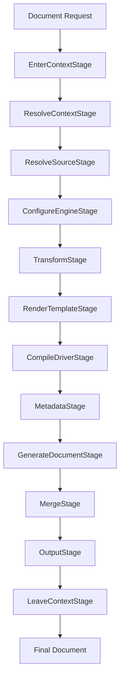
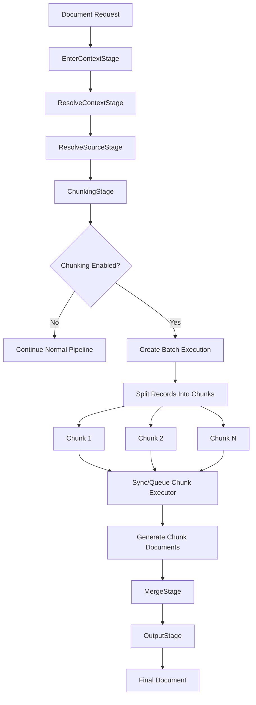
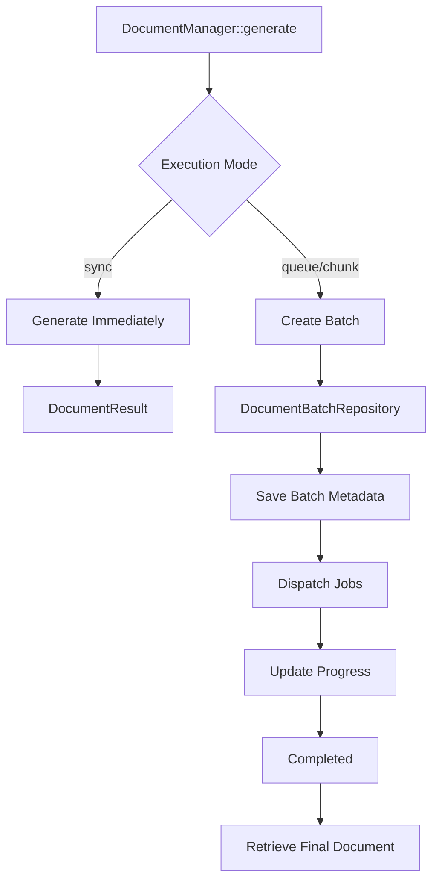

# Document Pipeline Architecture

The Document Builder package uses a **pipeline-based document generation architecture**.  
Every document generation request passes through a sequence of specialized stages, where each stage has a single responsibility.

The pipeline is responsible for transforming a high-level document definition into a final generated artifact such as:

- PDF
- Excel
- Word
- CSV
- Other supported document formats

The architecture separates concerns such as:

- context resolution
- data loading
- chunk processing
- data transformation
- template rendering
- document compilation
- metadata generation
- output storage

This makes the system extensible and allows new drivers, renderers, storage backends, and processing strategies to be added without changing the core pipeline.

---

# Pipeline Lifecycle

The default document pipeline executes the following stages:

```text
EnterContextStage
        |
        v
ResolveContextStage
        |
        v
ResolveSourceStage
        |
        v
ChunkingStage
        |
        v
ConfigureEngineStage
        |
        v
TransformStage
        |
        v
RenderTemplateStage
        |
        v
CompileDriverStage
        |
        v
MetadataStage
        |
        v
GenerateDocumentStage
        |
        v
MergeStage
        |
        v
OutputStage
        |
        v
LeaveContextStage
```


# Document Generation Flow

The Document Builder pipeline supports two execution modes:

1. **Standard generation** — the complete dataset is processed in one pipeline execution.
2. **Chunked generation** — large datasets are split into independent chunks, processed separately, then merged.

The pipeline stages remain the same conceptually, but chunking changes the execution strategy.

---

# Standard Document Generation Flow

When chunking is not enabled, the document follows a straight pipeline execution.



# Chunked generation 




